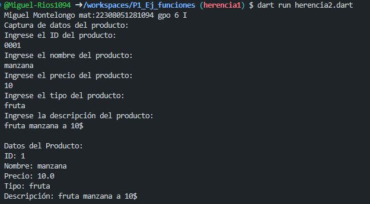
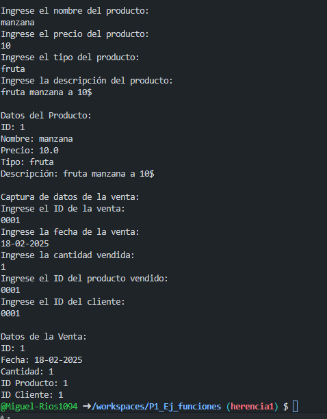

crear la clase Producto con los atributos(id,nombre,precio,tipo,descripcion) con una función capturadatos(), con interacción de interfaz de usuario. crear la clase datosProducto con herencia Producto y una funcion mostrarDatos().

crear la clase Ventas con los atributos(id,fecha,canidad,id_producto,id_cliente) con una función capturadatos(), con interacción de interfaz de usuario. crear la clase datosVentas con herencia Ventas y una funcion mostrarDatos(). lenguaje dart

