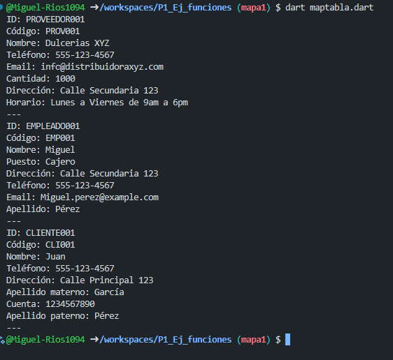

crear map <string, dinamic> Cliente id con los siguientes key, codigo, nombre, Telefono, direccion, apellido materno, cuenta, apellido paterno . y mostrar los datos con un for each lenguaje dart

crear map <string, dinamic> Empleado id con los siguientes key, codigo, nombre, Puesto, direccion, Telefono, email, apellido. y mostrar los datos con un for each lenguaje dart

crear map <string, dinamic> Proveedor id con los siguientes key, codigo, nombre, Telefono, email, cantidad, direccion, horario. y mostrar los datos con un for each lenguaje dart
